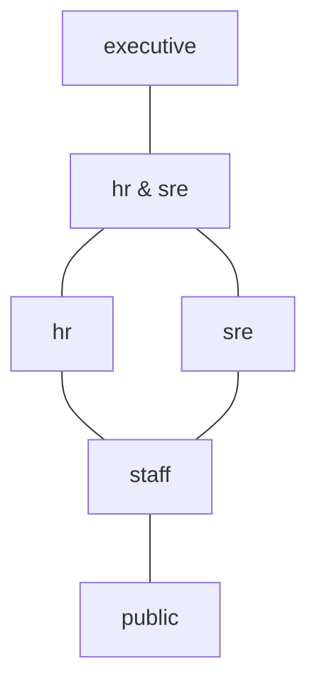
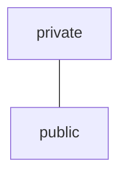

## まえがき

プログラムにおいて、それぞれの変数がどのように使用されているか、というのは重要な注意事項です。

例えば

- プライベートな情報をログに出さない
- URLに秘匿情報を入れない

などの規律があるでしょう。

我々はこれらの規律を守るために、人の目によるレビューやLintなどによる静的な解析を噛ませています。

この記事では、そんな中でも型システムを使って守る方法について考え、そこで純粋関数を区別することが、実用上役に立つことを確認します。また、これがCoeffectと呼ばれる型システムの一例であることを述べます。

ちなみに、この記事における議論は型システム一般の話であり、さらにこのようなシステムを導入している言語はまだ少ないことに注意する必要があります。裏を返せば、君が作ったDSLに今すぐ導入できることも意味しています！

かく言う僕も最近作っている言語にはprivateマーカーという機能を入れていて、値のプライバシーを追跡できます。

https://katari-lang.dev/docs/v0.1/concepts/types-and-schemas#private-values

## セキュリティ束

まず、セキュリティレベルというものを考えます。次のような状況を考えてみましょう。



社内で管理されるあらゆる情報にセキュリティレベルが付き、情報がもつレベルかそれより高位のセキュリティレベルをもつ実体しかその情報にアクセスできない、とします。ここで、SRE(`sre`)と人事(`hr`)は、互いに見てはいけない情報があるため、比較できないものとします。

レベル`ℓ₁`と`ℓ₂`について、`ℓ₂`の方が高位のセキュリティレベルである状態を`ℓ₁ ⊑ ℓ₂`と書くことにします。

また、次の演算を定義しておきます:

- **join** `ℓ₁ ⊔ ℓ₂` = 両方より上位で最小のレベル（上位に寄せる演算）
- **meet** `ℓ₁ ⊓ ℓ₂` = 両方より下位で最大のレベル（下位に寄せる演算）

数学的には、これらのレベルは束をなします。

プログラム中に現れるそれぞれの型について、これらのセキュリティレベルを付与すると考えましょう。ここでは、`T of ℓ`の形でレベルを載せることとします。たとえば、`string of sre`は、SRE 以上の文脈で使われるべき文字列です。
また、`of X`を省いたら`of public`となることにします。

## 代入・関数適用時のチェック

これらの型に対するチェックは、次のように行います:

レベル`ℓ`の値は、`ℓ ⊑ ℓ'`であるときのみ、レベル`ℓ'`を要求する場所に置ける。

例えば`public`の値は`staff`を要求する場所に置けます（秘匿されるべき場所に公開データを入れても問題ない）が、逆はダメです。

具体的に、ログに残せるのはpublicな情報だけ、といった状況を考えます。それは次のように表せます。

```
// ログは public な引数を要求する
function log(message: string of public) -> null { ...実装... }
```

この`log`関数に対して、`staff`型の値を代入すると型エラーになります。

```
let secret: string of staff = ...
log(secret)   // ← staff ⋢ public で型エラー
```

### 問題点

この型システムにはいくつか問題があります。

例えば、文字列を連結する関数を考えます。

```
concat : (string, string) -> string
```

`concat`はレベルについて何と言うべきでしょうか。どんな引数であっても`public`に落とすのは危険です。だからといって、結果を全て`executive`にすると厳しすぎます。結果的に、両方`public`なら結果は`public`、両方`staff`なら結果は`staff`、両方`sre`なら結果は`sre`……とたくさんパターンを書かなければいけなくなります。

```
concat : (string of public, string of public) -> string of public
concat : (string of sre, string of sre) -> string of sre
...
```

すべてのユーティリティ関数についてこれを記述するのは現実的ではないでしょう。

また、ifやswitchによる分岐にも問題があります。

```
if(pred) {
  ... 何か処理
} else {
  ... 何か処理
}
```

ここで`pred`について、何を課せば良いでしょうか。例えば、`staff`しか知り得ない情報で分岐してしまうと、`then`が実行されたか`else`が実行されたかが分かってしまいます。かといって、`public`でのみしか分岐できないというのも窮屈です。

## 純粋関数と持ち上げ（lift）

ここで、関数の純粋性について考えてみます。関数が純粋であるというのは、その実行に際して外界に影響を与えないということです。例えば、先ほどの`concat`や多くのユーティリティ関数がそうでしょう。言い換えれば、関数の引数はその戻り値のみに影響を与えます。

セキュリティレベル`of X`は、その値が`X`以上の文脈でのみ使われる、ということを意味しているのでした。ここで少々考えると、`concat`の引数にとって、その引数が使われる文脈、というのは`concat`の戻り値が何処で使われるか、というのと同義です。なぜなら、`concat`は純粋関数であり、引数が外部に漏れることなく、戻り値だけに影響を与えるからです。

そこで、次のような操作を認めてしまいましょう。

純粋関数 `f` と、任意のレベル `P` について：

```
        f : (A of X, B of Y) -> C of Z            （純粋）
  ────────────────────────────────────────────────  lift_P
   lift_P(f) : (A of X⊔P, B of Y⊔P) -> C of Z⊔P
```

つまり、引数と戻り値それぞれに同じセキュリティレベルでもって`join`演算⊔(両方より上位のレベルのうち最小のものをとる演算)を施してあげる操作です。

例えば、

`concat : (string, string) -> string`（全部 public）を `P = staff` で持ち上げると

```
lift_staff(concat) : (string of staff, string of staff) -> string of staff
```

となります。直感的には、戻り値が`staff`以上の文脈でのみ使われるのだから、引数も`staff`でよい、という事です。

この`lift`が型システム上暗黙に行われれば、ユーザー側が書くのは`public`版の`concat`のみで良いことになります。

### 純粋でない関数の場合

副作用のある関数では、これらの議論は成り立ちません。

```
function shout(a: string, b: string) -> string {
  console.log(a)              // 引数をlogに出力
  string.concat(a, b)
}
```

`shout`を`P = staff`に持ち上げると、`shout`は`string of staff`な`a`を受け取れるようになります。しかし、`a`はログ出力されるので、もはや安全ではありません。

したがって、持ち上げ操作ができるのは純粋関数に限るべきです。

### 分岐の場合

分岐における問題点も、少々複雑ですが、純粋性に帰着できます。それは次のルールの導入です。

1. scrutinee/predicateがpublicだった場合、問題なく分岐する。
2. scrutinee/predicateがpublicより上位のレベル`ℓ`だった場合、次のルールに従う。
   1. switchのそれぞれの分岐の中身、ifのthen/elseの中身が純粋であるなら、OK。結果型`A of X`について、`A of X⊔ℓ`を戻り値とする。
   2. 逆に、純粋でない場合は、型エラー

先ほどの議論と同様に、分岐したという情報は、それぞれのブランチが純粋なら結果のみに現れるので、結果型のセキュリティレベルを縛ってあげれば良いです。

※タイミング攻撃などは防ぐことができないのですが、これはこの型システムの限界です。

## 具体例：`url` と `body`

ここからは実際に僕が作っている言語 [Katari](https://katari-lang.dev)の構文を使って解説していきます。

Katari では、セキュリティ束は`public`/`private`の二値です。(後々もっと増やします！)



HTTP`fetch`は次のような型を持っています。

```katari
external agent fetch(
  url:     string,                     // ← public のみ
  method:  string,                     // ← public のみ
  headers: record[string of private],  // ← private も可
  body:    string of private,          // ← private も可
) -> response with io
```

URLに関しては秘匿情報を避けたいです。`method`はそもそも固定の文字列なので、`private`である必要はありません。一方`headers`と`body`は、プログラムが名指しした宛先サーバーにだけ届くので、`private`値を代入することが出来ます。

そして重要なのが`with io`で、Katariには副作用トラッキングの仕組みが標準でついています。ここでは、inbound/outboundが発生する可能性のある関数として、`fetch`をマークしています。

以下は型チェックの例です。

```katari
let token: string of private = credentials.resolve(source = ...)

// OK
http.fetch(
  url = "https://api.example.com/v1/me",
  method = "GET",
  headers = record.of("Authorization", f"Bearer ${token}"),
  body = "",
)

// コンパイルエラー
http.fetch(
  url = f"https://api.example.com/v1/me?access_token=${token}",
  method = "GET",
  headers = record.empty(),
  body = "",
)
```

コンパイルエラーについて詳しく見てみます。

`token`のセキュリティレベルが、f-string（これは`concat`の糖衣です）を跨いでトラッキングされ、引数群の型と照合されます。ここで、URLは`of public`を求めているのに対し、渡した文字列は`of private`です。型チェッカーは持ち上げも試みますが、この関数は副作用`with io`を持つので、それも不可能です。

現時点のKatariに入っているのは、この`public`/`private`の2段だけです。

次のような拡張を目指しています。

- 一般の束を導入して、ユーザー定義のセキュリティレベルを導入
- たとえばURLごとにセキュリティレベルを設定するなど、より細かい制御を可能にする

## 発展:Coeffect

ここまでの構造をまとめます。

- セキュリティレベルの集合があって、**順序**`⊑`が入っている
- **join**`⊔`で上位に寄せる（持ち上げ）
- **meet**`⊓`で下位に寄せる（この記事では表に出ませんでしたが、たとえば引数のレベルを推論するときに要ります。ある変数が複数の場所で使われるなら、そのすべてのレベルのmeet以下でなければならない）

これらは、joinを`×`、meetを`+`、さらに`⊑`を順序として見れば**順序付半環**になります。

ここで、任意の順序付き半環を型で追跡できるようにした体系が、**Coeffect**です。半環を差し替えることで、追跡対象を変えることが出来ます。

| 半環                 | 追跡できるもの                                                                                                             |
| -------------------- | -------------------------------------------------------------------------------------------------------------------------- |
| `(ℕ, +, ×, 0, 1, ≦)` | 変数の使用回数の上限                                                                                                       |
| `{0, 1, ω}`          | 使わない変数、1回のみ使う変数、何回でも使える変数                                                                          |
| セキュリティ束       | この記事の話                                                                                                               |
| エンドポイントの集合 | 変数がどのエンドポイントに置かれているか(僕の学士の研究です: https://prg.comp.isct.ac.jp/papers/pdf/matsuyama-pro2025.pdf) |

要するにCoeffectは、**リソースのメタ情報**を柔軟に追跡するための枠組みです。Coeffectについては去年の関数型まつりでも話しているので、是非スライドもご覧ください！(もう少し理論方面の話をしています): [Effect の双対、Coeffect](https://speakerdeck.com/yukikurage/effect-noshuang-dui-coeffect)

なお、Katariのprivacy属性は、厳密にはCoeffectそのものではありません。というのも、通常のCoeffectシステムの持ち上げは、戻り値が`public`、つまり最も弱いレベルを仮定する必要があります。

`(A of X, B of Y) -> C` → `(A of X⊔P, B of Y⊔P) -> C of P`

Katariは、戻り値もレベルを持てます。

`(A of X, B of Y) -> C of Z` → `(A of X⊔P, B of Y⊔P) -> C of Z⊔P`

この点でKatariは、通常のCoeffectシステムより強いシステムを持っていることになります。ただ実は、上に挙げた4つのCoeffectは全てこの構造を持つことができ、逆にこの構造を持つことができないCoeffectは(僕の経験上)少ないです。

## まとめ

- セキュリティレベルを束にして、値のレベルを型に載せることで型チェックでセキュリティ不適合を防ぐことが出来る。
- 持ち上げによって、各種関数の重複定義を避けることが出来る。
- 純粋関数、つまり、引数の影響が戻り値にだけ影響する関数のみ、持ち上げが可能。
- 分岐も同様で、各ブランチが純粋であれば任意のレベルで分岐でき、結果型にそのレベルがjoinされる。
- 従って、Coeffectを実用化するには、副作用のトラッキングもセットで実装しておきたい。

## 参考文献

- D. E. Denning, "A Lattice Model of Secure Information Flow", CACM, 1976
- D. Volpano, C. Irvine, G. Smith, "A Sound Type System for Secure Flow Analysis", JCS, 1996
- A. C. Myers, "JFlow: Practical Mostly-Static Information Flow Control", POPL, 1999
- P. Li, S. Zdancewic, "Encoding Information Flow in Haskell", CSFW, 2006
- T. Petricek, D. Orchard, A. Mycroft, "Coeffects: A Calculus of Context-Dependent Computation", ICFP, 2014
- M. Gaboardi, S. Katsumata, D. Orchard, F. Breuvart, T. Uustalu, "Combining Effects and Coeffects via Grading", ICFP, 2016
