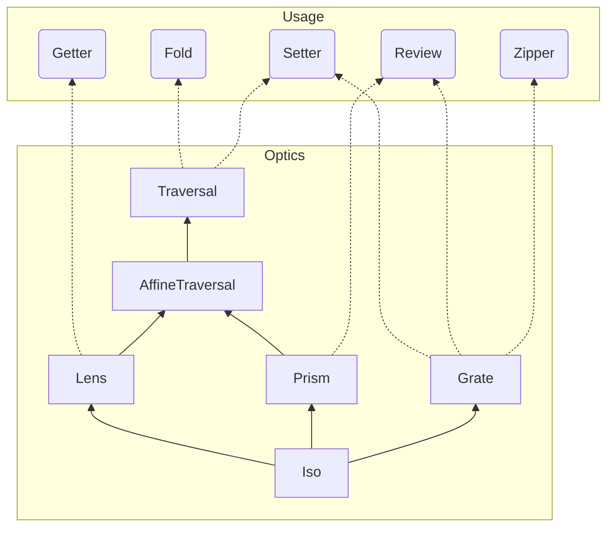

:::message
基本的に PureScript を用いて説明をします。

今回書いたコードは [GratePlayGround.purs (yukikurage/free-exists)](https://github.com/yukikurage/free-exists/blob/master/src/GratePlayGround.purs) に置いてあります。
:::

## 初めに

最近(主に自分の)TL でにわかに流行を見せている Optics _a.k.a. Lens_ ですが、2015 年に Grate という Optics が登場していたのをご存じでしょうか？ PureScript の Optics ライブラリ [purescript-profunctor-lenses](https://pursuit.purescript.org/packages/purescript-profunctor-lenses) には Grate Optics が採用されています。

しかし、Grate Optics について触れた日本語記事は相当少なそうなので、自身の整理も兼ねて記事にします。

Optics のヒエラルキーなど、Optics 全体についても軽くまとめているので Optics 分からんという方にも読んでいただけると嬉しいです！

## Grate Optics

Grate の初出はココ？だと思います

https://r6research.livejournal.com/28050.html

曰く、Grate は Closed な p に対する `Optics p` です。(？？)

### Optics の復習

`Optics` とは次のような型です:

```hs
type Optics p s t a b = p a b -> p s t
```

この `p` に色々な型クラスで色々な制約を掛けることで、Lens や Prism などの Optics になります。具体的には次のようになっています:

| 名称            | 制約           | お気持ち       |
| --------------- | -------------- | -------------- |
| Iso             | Profunctor     | 同型           |
| Lens            | Strong         | 直積の片方     |
| Prism           | Choice         | 直和の片方     |
| AffineTraversal | Strong, Choice | 0 ~ 1 個の要素 |
| Traversal       | Wander         | 0 ~ n 個の要素 |

:::message
型クラスのヒエラルキーは次のようになっています:

- Strong ならば Profunctor
- Choice ならば Profunctor
- Wander ならば Strong だし Choice

したがって Lens の制約は実質「Profunctor, Strong」になりますし、Traversal の制約は「Profunctor, Strong, Choice, Wander」になります。

ココがちょっとややこしいですが、制約が強いほど、当てはまる型が多くなります。Optics を定義するときに p の制約が多い方が関数 p a b -> p s t を作りやすい、という事ですね。

したがってこれらの Optics には「Iso ならば Lens」「Lens ならば Traversal」みたいな関係が成り立っている訳です。この関係は後にわかりやすい図でまとめます。
:::

### Closed の導入

ここで、`p` の制約に `Closed` を付けたものが Grate です:

| 名称  | 制約   | お気持ち   |
| ----- | ------ | ---------- |
| Grate | Closed | zip 可能？ |

`Closed` はライブラリ [purescript-profunctor](https://pursuit.purescript.org/packages/purescript-profunctor/docs/Data.Profunctor.Closed#t:Closed) で定義されていて、次のような型クラスです:

```haskell
class Profunctor p <= Closed p where
  closed :: forall a b x. p a b -> p (x -> a) (x -> b)
```

`Strong` や `Choice` が `Tuple` や `Either` を導入しているのと同じように `Function` を導入したものですね:

```haskell
class Profunctor p <= Strong p where
  first :: forall a b c. p a b -> p (Tuple a c) (Tuple b c)
  second :: forall a b c. p b c -> p (Tuple a b) (Tuple a c)

class Profunctor p <= Choice p where
  left :: forall a b c. p a b -> p (Either a c) (Either b c)
  right :: forall a b c. p b c -> p (Either a b) (Either a c)
```

理論的な事はよくわかっていないので圏論とかで何を意味するのかは知りませんが、直感的には次が言えそうです:

- `Tuple` の片方に注目する Optics が Lens で、`Either` の片方に注目する Optics が Prism なら、`Function` の返す値に注目するのが Grate なんじゃないかなァ～

実はこの直感は正しいです。詳しくは"例"のセクションで……

## Optics を使う側

Optics はそれらを使う側も大事です。これらは Optics の `p` に具体的な型を入れ消費することが出来ます。その型が満たす制約によって、それらがどの Optics に適用できるかが変化する訳です。

| 名称       | p                              | 満たす制約     | 代表的なできる事                           |
| ---------- | ------------------------------ | -------------- | ------------------------------------------ |
| Getter     | Forget a                       | Strong         | `view` 内側の値の取り出し                  |
| Fold       | Forget r (ただし r は Monoid)  | Wander         | `toListOf` リストへの変換                  |
| Review     | Tagged                         | Choice, Closed | `review` コンストラクタ(のようなもの)      |
| Setter     | (->)                           | Wander, Closed | `over` 内側の値への関数適用 _a.k.a. `map`_ |
| (Zipper？) | Costar f (ただし f は Functor) | Closed         | `zipFWithOf` Zip する                      |

:::message
Zipper は特段名称はついてませんでした。ただ名前を付けるとしたら Zipper が適当かなぁ、と思っています。
:::

肝心の Grate は `zipFWithOf` 関数により、`p` が `Coastar f` という型になり消費されます。詳しくは"例"のセクションで……2

### ヒエラルキーの図

ここまでの `p` の制約や `p` の具体型の満たす制約などを加味してまとめると次のようなハッセ図っぽいものが出来ます:



角がとがっているのが Optics, 丸いのが Optics を使う側です。

矢印は Optics の包含関係を表し、例えば「Iso ならば Lens」「Lens ならば Traversal」と読めます。

点線矢印はどの様に消費できるかを表し、例えば「Traversal なら Fold として使える」「Iso ならば Prism なので Review として使える」と読めます。

## 例

さて、Grate は Setter, Review, Zipeer として使うことが出来そうです。このセクションでは具体的な型について Grate Optics を作り、使ってみます。

### Pair

次のような Pair 型を考えます。単純に 2 つ組を作るものです。

```haskell
data Pair a = Pair a a

derive instance Generic (Pair a) _

instance Show a => Show (Pair a) where
show = genericShow

-- | 一つ目の要素を取り出す
pFst :: forall a. Pair a -> a
pFst (Pair x \_) = x

-- | 二つ目の要素を取り出す
pSnd :: forall a. Pair a -> a
pSnd (Pair \_ y) = y
```

まずは Grate Optics を作ります。Grate を作る `grate` という関数が用意されていて、それは次のようなシグネチャを持っています。

```haskell
grate :: forall s t a b. (((s -> a) -> b) -> t) -> Grate s t a b
```

なんだかすごく階層が深くて「関数を取る関数を取る関数を取る関数」になってますが、使っているのを見ると以外に単純です:

```haskell
-- | Grate Optics の定義
pairGrate :: forall a. Grate (Pair a) (Pair b) a b
pairGrate = grate \f -> Pair (f pFst) (f pSnd)
```

`grate` に `((s -> a) -> b) -> t` を渡せば良いので、`f :: (s -> a) -> b` を受け取って `t` を返す関数が欲しいです。

そのような関数の作り方ですが、この `f :: (s -> a) -> b` に `s -> a`、つまり何かしら値を取り出す関数、──`Pair` の場合 `pFst` と `pSnd`、を渡せばそれぞれ `b` が得られるので、それらをいい感じに組み合わせて `t` を作ればよいです。

ちなみに条件さえ満たせばより単純な定義も使うことができ、それは次のセクションで紹介します。

さて、`pairGrate` に対して、Review、Setter の操作を行います:

```haskell
-- | Review の操作
-- | == Pair 1 1
pairReviewTest :: Pair Int
pairReviewTest = review pairGrate 1

-- | Setter の操作
-- | == Pair 2 3
pairSetterTest :: Pair Int
pairSetterTest = over pairGrate (\_ + 1) (Pair 1 2)
```

型エラーもなく動いています！

最後に Zipper の操作ですが、次のような関数が用意されています:

```haskell
zipFWithOf :: forall f s t a b. Optic (Costar f) s t a b -> (f a -> b) -> (f s -> t)
```

つまり `f a` を `b` に変換するような関数を渡せば、`f s` を `t` に変換できるということです。試してみましょう:

```haskell
-- | Zipper の操作
-- | == Pair 4 6
pairZipperTest :: Pair Int
pairZipperTest = zipFWithOf pairGrate sum [ Pair 1 2, Pair 3 4 ]
```

このように、`f a -> a` として `sum :: Array Int -> Int` を渡せば、`f s -> s` として `Array (Pair Int) -> Pair Int` が入手できます。これは `Pair`　を左右に分割してそれぞれ `sum` を実行し、最後に再度 `Pair` でまとめたような動作をする関数です。

このように、zip っぽい動作ができるのが Grate の特徴です。

### Function

さて、実は関数(の右辺)も Grate Optics として扱えます。これが "Closed の導入" セクションで触れた物ですね。

ここでは `Int` を引数に取るようなナイスな関数を考えてみます:

```haskell
type NiceFunction a = Int -> a
```

この右辺、a に注目するような Grate Optics が欲しいわけですね。それでは作ります:

```haskell
niceFunctionGrate :: forall a. Grate (NiceFunction a) (NiceFunction b) a b
niceFunctionGrate = grate \f -> \n -> f \nf -> nf n
```

流石にややこしいですね。`Pair` ではまだマシでしたが、ただでさえ関数がネストしていたのにさらに関数を扱おうとしているので、なんと「関数を取る関数を取る関数を取って関数を返す関数を取る関数」になっています。

これでは実用に耐えないので、Grate Optics を作るもう一つの方法 `contraversed` を紹介します。これは次のようなシグネチャを持っています:

```haskell
contraversed :: forall f a b. Distributive f => Grate (f a) (f b) a b
```

`Distributive` であるような `f` に対しては `Grate (f a) (f b) a b` が作れるということらしいです。

`Distributive` は [purescript-distributive](https://pursuit.purescript.org/packages/purescript-distributive/docs/Data.Distributive#t:Distributive) パッケージで定義されている型クラスで、Traversable の双対らしいですが、詳しいことは全然知らないので割愛します……

ともかく、実際に `Function e` は `Distributive` のインスタンスであるので、次のように定義できます:

```haskell
niceFunctionGrate :: forall a. Grate (NiceFunction a) (NiceFunction b) a b
niceFunctionGrate = cotraversed
```

簡単ッッッ！！簡単ッッ！！！

さて、`Pair` と同様にこの Grate Optics に対して Review、Setter、Zipper の操作を適用していきます:

```haskell
-- | niceFunctionHello 1 == "Hello"
-- | niceFunctionHello 4 == "Helloooo"
niceFunctionHello :: NiceFunction String
niceFunctionHello n = "Hell" <> power "o" n

-- | niceFunctionHello 1 == "World"
-- | niceFunctionHello 4 == "Worrrrld"
niceFunctionWorld :: NiceFunction String
niceFunctionWorld = \n -> "Wo" <> power "r" n <> "ld"

-- | Review の操作
-- | 常に "Const" を返す関数になる
niceFunctionReviewTest :: NiceFunction String
niceFunctionReviewTest = review niceFunctionGrate "Const"

-- | Setter の操作
-- | 結果の値に ! を追加
-- | niceFunctionSetterTest 1 == "Hello!"
-- | niceFunctionSetterTest 4 == "Helloooo!"
niceFunctionSetterTest :: NiceFunction String
niceFunctionSetterTest = over niceFunctionGrate (_ <> "!") niceFunctionHello

-- | Zipper の操作
-- | niceFunctionZipperTest 1 == "Hello World"
-- | niceFunctionZipperTest 4 == "Helloooo Worrrrld"
niceFunctionZipperTest :: NiceFunction Int
niceFunctionZipperTest = zipFWithOf niceFunctionGrate intercalate " " [ niceFunctionHello, niceFunctionWorld ]
```

問題なく動いていますね！

### 他の Optics との組み合わせ

さて、Grate は他の Optics と組み合わせて使うことも出来ます。Lens や Prism と組み合わせると Zipper としては使えなくなってしまうのですが、引き続き Review や Setter としては使えるので、試してみましょう。

#### w/ Lens

さて、次のような型を考えます:

```haskell
type WithLens a = NiceFunction { hello :: a, world :: String }
```

レコード中の hello に注目する Lens を作りたいですが、`prop` で一発です。Row Polymorphism に感謝:

```haskell
helloLens :: forall a b r. Lens { hello :: a | r } { hello :: b | r } a b
helloLens = prop (Proxy :: Proxy "hello")
```

さて、ヒエラルキーを見ると、Lens と Grate の組み合わせには Setter が使えることが分かるので、さっそく使ってみます:

```haskell
-- | hello にそのまま n を突っ込む NiceFunction
before :: WithLens Int
before = \n -> { hello: n, world: "world" }

-- | 結果の hello に show を適用
after :: WithLens String
after = over (niceFunctionGrate <<< helloLens) show before
```

Grate を経由するとできる操作が結構限られちゃいますが、このように関数も Optics の対象として扱ってデータ構造のより深い部分まで潜れるのは嬉しいですね。

#### w/ Prism

Prism との組み合わせでは、Review が使えます:

```haskell
type WithPrism a = NiceFunction (Either a Int)

-- | 常に `Left "I think I'm on the left."` を返す
reviewed :: WithPrism String
reviewed = review (niceFunctionGrate <<< _Left) "I think I'm on the left."
```

常に `Left "I think I'm on the left."` を返す関数が得られました。

#### w/ Grate

もちろん Grate 自身ネストすることが出来ます。ちょうどここに `Pair` と `NiceFunction` という二つの Grate Optics の対象があるので組み合わせてみます:

```haskell
-- | NiceFunction の二つ組
type NiceFunctionPair a = Pair (NiceFunction a)

-- | Review の操作
-- | 常に "Const" を返す関数の Pair ができる
niceFunctionPairReviewTest :: NiceFunctionPair String
niceFunctionPairReviewTest = review (pairGrate <<< niceFunctionGrate) "Const"

-- | テスト用の NiceFunctionPair
niceFunctionPair :: NiceFunctionPair String
niceFunctionPair = Pair niceFunctionHello niceFunctionWorld

-- | Setter の操作
-- | Pair のそれぞれの NiceFunction の結果に ! を追加
niceFunctionPairSetterTest :: NiceFunctionPair String
niceFunctionPairSetterTest = over (pairGrate <<< niceFunctionGrate) (_ <> "!") niceFunctionPair

-- | Zipper の操作
-- | 結果の値 Pair f g に対して
-- | f 5 == "Hellooooo Hellooooo"
-- | g 5 == "Worrrrrld Worrrrrld"
niceFunctionPairZipperTest =
  zipFWithOf
    (pairGrate <<< niceFunctionGrate)
    (intercalate " ")
    [ niceFunctionPair, niceFunctionPair ]
```

Grate 同士で組み合わせる分には Zipper が使えなくなったりしないので、思う存分合成できますね！

## まとめ

ざっと見た感じ Grate は Zip できるという性質を表す Optics、と言えそうです。また、Zip できる特性は失われますが、他の Optics と組み合わせても問題なく使えます。

あと、`Pair` は実は Traversal でもあるので、Grate と Traversal を同時に満たす Optics とかそういうのも管理したいよね、と思いました。(組合せ爆発起きそうな気がしますが……)

Distributive との関連はまだよく分かっていないので、もう少し調べてみたいです。

## 最後に

Optics いいよね。みんなも使おう、Optics。
